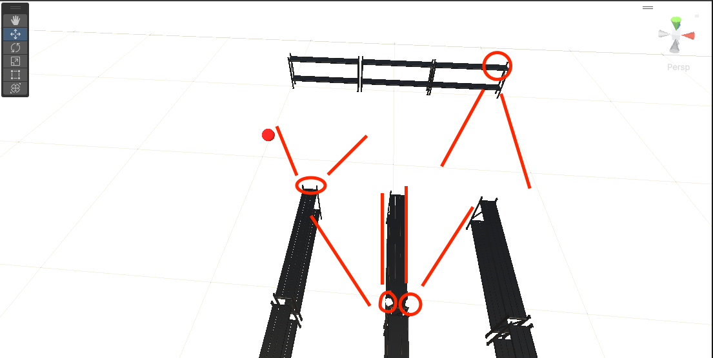

# Simulating stereo triangulation of a customer walking through a warehouse in Unity3D

All cameras in the scene take a picture on a one second loop. That picture is inspected and the average location of the red pixels is extracted.

This pixel coordinate location is used along with the corresponding camera's intrinsic and extrinsic parameters to create a world space ray. 

Pairs of cameras are used to calculate their ray intersection point to estimate the 3D position of the red sphere. 

Their estimate is visualized through a green sphere with text displaying which two cameras created the estimate. 

Cameras that are being used in the 3D prediction are shown in green. If multiple camera pairs produce a prediction the average is used.

[[Simple Tracking Video Demo]](https://vimeo.com/971942725?share=copy)

# Simulated cameras and FOV

# Known Issues 
If the red sphere is not fully visible in the camera image, the center point coordinates will be off leading to incorrect 3D estimates. 
Lag during the picture capture and processing. 

# To Run 
Download zip files and unpack. Use Unity 2023.2.3f1 or higher to launch the project and press play to start the simulation.
